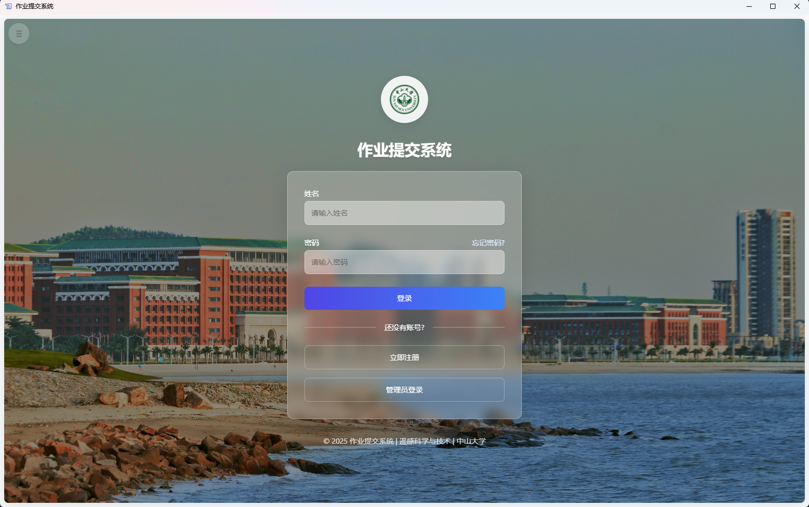
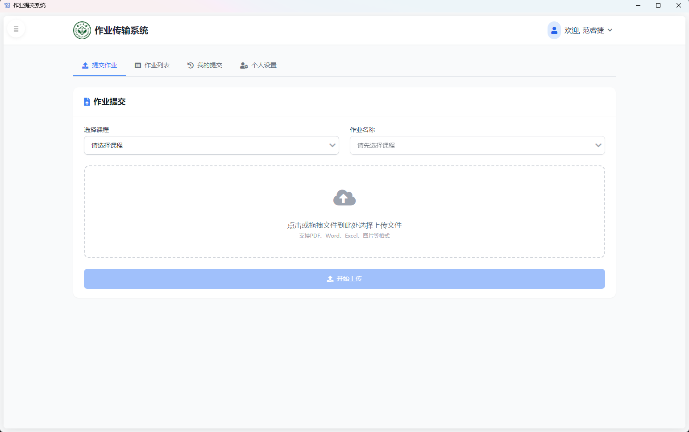
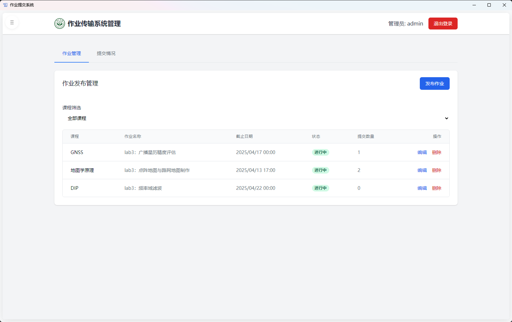
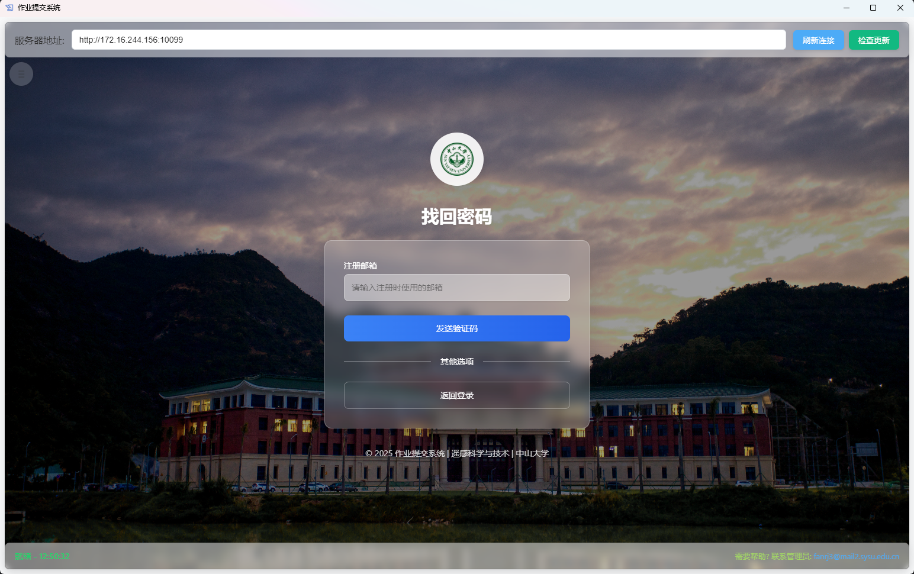

# StarVortex
[中文](README_zh.md) | [English](README.md)

A modern Flask-based homework submission and management system supporting student uploads, teacher management, submission tracking, and detailed statistical analysis. The system features responsive design, a desktop client, and online updates, ensuring an excellent user experience across all devices.


## ✨ Features

- 🔒 Secure user authentication with separate student/admin logins
- 📧 Email verification registration and password recovery
- 📤 Drag-and-drop file uploads with progress indication
- 📋 Detailed submission statistics and filtering
- 📱 Responsive design for mobile and desktop
- 🖥️ Desktop client with auto-update functionality
- 📨 Automatic email notifications upon submission
- 🛠️ Advanced file restriction options with customizable file types and sizes

## 🔥 Core Functionality

### Student Side

- User registration and login (email verification)
- File upload and management
- Personal submission history viewing
- Profile management

### Admin Side

- Course and assignment configuration
- Student submission statistics
- Batch download of student submissions
- Export submission statistics (Excel format)

## 🚀 Quick Start

### Server Deployment

1. Clone the repository
   ```bash
   git clone https://github.com/FrankLightcone/StarVortex.git
   cd StarVortex
   ```

2. Install dependencies
   ```bash
   pip install -r requirements.txt
   ```

3. Configure email service
   - Edit the `util/email_config.py` file with valid SMTP server information

4. Start the application
   ```bash
   python main.py
   ```

5. Access the following links
   - Student interface: http://localhost:10086/
   - Admin interface: http://localhost:10086/admin

### Desktop Client Usage

1. Download the latest version from the [releases page](https://github.com/FrankLightcone/StarVortex/releases)
2. Install and launch the application
3. Enter the server address to connect

## 📊 System Architecture

```
HomeworkHub/
├── main.py                   # Main application entry
├── requirements.txt          # Dependency list
├── static/                   # Static files directory
│   ├── css/                  # Style files
│   ├── js/                   # JavaScript files
│   ├── img/                  # Image resources
│   └── upload/               # Upload storage directory
├── templates/                # HTML templates directory
├── util/                     # Utility modules directory
│   ├── admin.py              # Admin functionality module
│   ├── api.py                # API interface module
│   ├── auth.py               # Authentication module
│   ├── models.py             # Data model module
│   ├── student.py            # Student functionality module
│   └── utils.py              # Common utility functions
└── desktop/                  # Desktop client source code
```

## 📸 Screenshots

<table>
  <tr>
    <td></td>
    <td></td>
  </tr>
  <tr>
    <td></td>
    <td></td>
  </tr>
</table>

## 📝 Configuration Parameters

| Parameter | Description | Default Value |
|-----------|-------------|---------------|
| UPLOAD_FOLDER | File upload directory | static/upload |
| MAX_CONTENT_LENGTH | Maximum file size limit | 256MB |
| SMTP_SERVER | Email server address | smtp.example.com |
| SMTP_PORT | Email server port | 587 |
| ADMIN_USERNAME | Admin username | admin |

## 🔧 Advanced Configuration

The system provides rich configuration options that can be customized according to actual requirements:

1. Course configuration: Edit the `course_config.json` file
2. Assignment advanced restrictions: Set through the admin interface
3. Email templates: Modify the `util/email_templates.py` file

## 🗣️ Tech Stack

**Backend**
- Python + Flask
- Flask-Login (user authentication)
- Werkzeug (security components)

**Frontend**
- HTML5 + CSS3
- TailwindCSS
- JavaScript (vanilla)

**Desktop Client**
- Electron
- Node.js

## 📄 License

[MIT License](LICENSE)

## 👥 Contributing

Issues and pull requests are welcome!