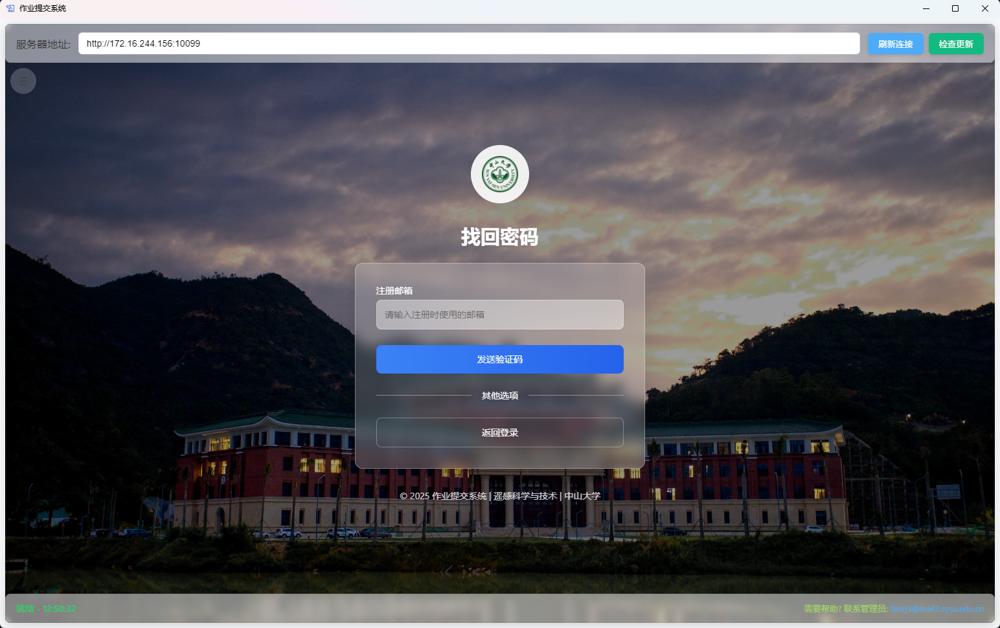

# 恒星旋涡 (StarVortex)
[English](README.md) | [中文](README_zh.md)

这是一个基于Flask的现代化作业提交与管理系统，支持学生上传作业、教师管理与查看提交情况，以及详细的统计分析功能。系统采用响应式设计，提供了桌面客户端，支持在线更新，确保在各种设备上都能获得良好的用户体验。


## ✨ 特性

- 🔒 安全的用户认证系统，支持学生/管理员分离登录
- 📧 邮箱验证注册流程与找回密码功能
- 📤 拖放式文件上传界面，支持进度显示
- 📋 详细的作业提交情况统计与筛选
- 📱 响应式设计，完美适配移动端和桌面端
- 🖥️ 桌面客户端，支持自动更新
- 📨 提交完成自动邮件通知功能
- 🛠️ 高级文件限制选项，支持自定义允许的文件类型和大小

## 🔥 主要功能

### 学生端

- 用户注册与登录（邮箱验证）
- 文件上传与管理
- 个人提交记录查看
- 个人信息管理

### 管理员端

- 课程与作业配置
- 学生提交情况统计
- 批量下载学生提交
- 导出提交统计数据（Excel格式）

## 🚀 快速开始

### 服务器部署

1. 克隆仓库
   ```bash
   git clone https://github.com/FrankLightcone/StarVortex.git
   cd StarVortex
   ```

2. 安装依赖
   ```bash
   pip install -r requirements.txt
   ```

3. 配置邮件服务
   - 编辑 `util/email_config.py` 文件，填入有效的SMTP服务器信息

4. 启动应用
   ```bash
   python main.py
   ```

5. 访问以下链接
   - 学生界面：http://localhost:10086/
   - 管理员界面：http://localhost:10086/admin

### 桌面客户端使用

1. 从[发布页面](https://github.com/FrankLightcone/StarVortex/releases)下载最新版本
2. 安装并启动应用程序
3. 输入服务器地址进行连接

## 📊 系统架构

```
作业传输系统/
├── main.py                   # 主应用程序入口
├── requirements.txt          # 依赖包列表
├── static/                   # 静态文件目录
│   ├── css/                  # 样式文件
│   ├── js/                   # JavaScript文件
│   ├── img/                  # 图片资源
│   └── upload/               # 上传文件存储目录
├── templates/                # HTML模板目录
├── util/                     # 工具模块目录
│   ├── admin.py              # 管理员功能模块
│   ├── api.py                # API接口模块
│   ├── auth.py               # 认证功能模块
│   ├── models.py             # 数据模型模块
│   ├── student.py            # 学生功能模块
│   └── utils.py              # 通用工具函数
└── desktop/                  # 桌面客户端源码
```

## 📸 截图展示

<table>
  <tr>
    <td></td>
    <td></td>
  </tr>
  <tr>
    <td></td>
    <td></td>
  </tr>
</table>
## 📝 配置参数

| 参数名 | 描述 | 默认值 |
|-------|------|-------|
| UPLOAD_FOLDER | 文件上传目录 | static/upload |
| MAX_CONTENT_LENGTH | 最大文件大小限制 | 256MB |
| SMTP_SERVER | 邮件服务器地址 | smtp.example.com |
| SMTP_PORT | 邮件服务器端口 | 587 |
| ADMIN_USERNAME | 管理员用户名 | admin |

## 🔧 高级配置

系统提供了丰富的配置选项，可以根据实际需求进行定制：

1. 课程配置：编辑 `course_config.json` 文件
2. 作业高级限制：通过管理员界面进行设置
3. 邮件模板：修改 `util/email_templates.py` 文件

## 🗣️ 技术栈

**后端**
- Python + Flask
- Flask-Login (用户认证)
- Werkzeug (安全组件)

**前端**
- HTML5 + CSS3
- TailwindCSS
- JavaScript (原生)

**桌面客户端**
- Electron
- Node.js

## 📄 许可证

[MIT License](LICENSE)

## 👥 贡献

欢迎提交问题和合并请求！